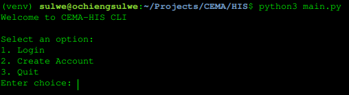

# CLI Health Information System
 ## Overview
This is a Command-Line Interface (CLI) Health Information System developed to manage patient-practitioner interactions and the management of patient-related data. It provides a secure and organized way for patients and practitioners to access, sign up for, and manage healthcare programs.
## Purpose
The Program is built to help `Practitioners` manage programs they are running.

A practitioner can `add` a `patient` to a `program` they are part of. Though not in the technical sense. What happens is that `A Practitioner` will always sign up to be part of a `program` they would want to run(which are available already in the system on startup), and then the `Patients` are given the liberty to choose both `Program` and `Practitioner` they would want to be engaged in.

This means that for a `Patient` to enjoy the full benefit of this utility, they must also have an account to track their programs as well as set reminders on when and what they are expected to take part in.

So, a `Practitioner` can access available `programs` which come with the system, they can help onboard `Patients` onto a `program`, they can view their `patients` the same way the `patients` can view all their `appointments` related to a program they are enrolled in. 

Something to NOTE: `Patients` can enrol with the same `practitioner` offering different `programs` but CANNOT enroll in the same `program` twice with the same `practitioner`.
## Asumptions
The system is built on the following assumptions:
- National Registry Access: The system can retrieve adult user information (e.g., full names, date of birth, etc.) by inputting their ID number. For children, the system uses birth certificate numbers to access data.

- Practitioner Registry Integration: The system fetches practitioner data (such as name and profession type) by providing a registration number and their professional category (e.g., Nurse).

**It is assumed the system has access/makes API calls to the necessary government databases and union registries for data validation and retrieval**
## Platform

This system is optimized for and works best on `Ubuntu Linux` environments.
## Accessing Start-Up Data
Startup data is stored in the following directories:

- Children’s birth certificate numbers:

[To Access Valid Child Birth Certificate Numbers For Child User Creation, Access This File](./utils/proxy/data/children.py)

- Adult citizens' ID numbers:

[To Access Valid Adult ID Numbers for Adult USer Account Creation,Access This File](./utils/proxy/data/citizens.py)

- Practitioners’ registration IDs and profession types:

[To Access Valid Practitioners Profession Registraion Related Data for Practitioner
Account Creation, Access This Link](./utils/proxy/data/practitioners.py)

These datasets are necessary to register and authenticate users into the system successfully.
The above datasets represent various third-party databases we are querying to establish the authenticity of data a user is supplying into the system.
## Running The Program
To start the system, follow these steps:

**Make sure to be in a virtual environment first, then install project requirements:**

`$ pip install -r requirements.txt`


**1. Start the API server**

Run the following file from the project root:

`$ ./api/v1/app.py`

To start the project's local server to allow for API calls

To view all the available `RESTful APIs`, open your favourite browser and cURL:

`http://localhost:5000/#/`

**2. Launch the CLI**

Start the CLI using:

`$ python3 main.py`

Both the `server` and the `CLI` should run concurrently

**NOTE**: Once in the `CLI`, **Double-click/Double-press-enter key** every input to ensure proper CLI interaction.
## Authentication
You will need first to authenticate user before using the system.
For now there are only two fully  functional User types:

`Adult User` and

`Practitioner User`

### User Creation
If `User` doesn't exist, you will have to create one.

For Patients, when prompted on the `CLI`, you will have to provide:

1. `ID NUMBER` - This you can get in the data file provided herein. This **MUST** be an existing ID Number assigned to an existing user in the [Start-up data](./utils/proxy/data/citizens.py).
2. `Phone number` - This can be any number
3. `email` - this can be any email, as long as a user of type `Adult` has a similar one; that will prevent you from creating an account
4. `password` - can be any character sequence

For Practitioners, you will have to provide:

1. `Profession Registration Number` - which **MUST** be a valid one assigned to any practitioner user as stored in the [start-up data](./utils/proxy/data/practitioners.py)
2. `email` - can be any email/character format, but must not be as one a user of type `practitioner` has signed in with already.
3. `password` - can be any character string
4. `phone number` - can be any phone number, unique, not to be existing with any user registered of type `practitioner`
5. `fee` - an integer charge; tentatively used as a consultation fee. Can be any integer
6. `profession type` - these are the supporting professions in the system for now. They **MUST** be one of the following **ONLY**:
   ```
   ClinicalOfficer
   Dentist
   Dietitian
   Doctor
   LabTech
   Nurse
   Pharmacist
   Physiotherapist
   Psychologist
   ```
For Child, you will only provide:

1. `Birth Certificate Number`- existing in [start-up data](./utils/proxy/data/children.py) information

The user creating a Child Account must be of type `Adult` and Logged in

### Login
All users login in with just:

`email` used to create account

`passord` used in account creation

The `CLI` will prompt you on what Account to login into, either:

`Adult Acccount` or,

`Practitioner Account`

## System Features
Upon startup, the CLI system offers a variety of features and workflows:
### Practitioner Features
- Sign in, sign out, and create an account.
- View all available healthcare programs.
- Link (sign up) to existing programs.
- View a list of all assigned patients.

**Practitioners can only view patients that are assigned to them.**

### Patient Features
- Sign in, sign out, and create an account.
- View all available healthcare programs.
- Sign up for healthcare programs directly.
- Choose a preferred practitioner when signing up.
- Automatically receive a booked appointment with the selected practitioner.
- View all personal appointments.

### Shared Features
**Role-based access control:**
Upon sign-in, users are routed to their respective dashboards:

1. `Adults → Adult Menu`
2. `Practitioners → Practitioner Menu`

## Tech Stack
```
Design: MVC
Language: Python
Backend: Flask (for REST API)
Database ORM: SQLAlchemy
Documentation & Style:
    Codebase is written following Google-style documentation for clarity and consistency.
All development was done in VIM, the developer's preferred code editor.
```

# PROTOTYPE
Below are but a few glimps of what the simple Health Information System can do in
additione to managing programs and patients: the prerequisites.
## Progrma Initialization
Make sure the `./api/v1/app.py` is running



## Acount Creation
For all new user, an account must be created to access the HIS
A user will always be prompted to what `account type` they want to create


### Adult Account Creation
All the listed information must be provide


### Practitioner Account Creation
Same as Adult, all the listed information must be included


## Log In
After a user account is created, they can always log in to utilise the system
A user will be always prompted into which `account type` to log into


### Adult Log In
To login an adult must provide the email and password used on account creation


### Practitoner Login 
To login, a practitioner must provide the email used in account creation


## Menus
These are the system interaction points.

They differ with every account. And When a user logs in, they are directed accordingly
the the appropriate User `MENU` interface

### Adult Menu
To enjoy what they system is capable of for an `Adult User` please play around with these
options in the menu


### Practitioner Menu
To have a feel of what a practitioner can do with this simple Health Information system,
   try doodle around with the selection options below
   


**ENJOY**
